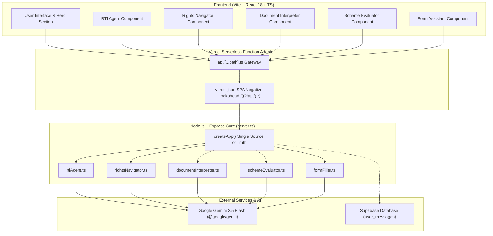

# 🏛️ Civil_AI

> **AI-Powered Civic & Statutory Legal Assistance Platform for Indian Citizens**  
> *Demystifying government processes, Right to Information (RTI) filings, citizen rights, scheme eligibilities, administrative forms, and bureaucratic documents.*

[](https://civil-ai-omega.vercel.app/)
[](LICENSE)
[](package.json)
[](https://ai.google.dev/)

---

## 🚀 Why Civil_AI?

In India, navigating public administration, local municipal bodies, and legal rights often presents significant friction for everyday citizens:

- **Complex Bureaucratic Jargon**: Official government notices, circulars, and gazette orders are written in heavy legal language that is difficult to interpret.
- **Unclear Escalation Pathways**: When a municipal service fails (e.g. water pipeline delay, road maintenance) or an RTI response is delayed, citizens rarely know the official 3-tier escalation ladder.
- **RTI Drafting Friction**: Formulating precise, legally compliant questions under Section 6(1) of the Right to Information Act 2005 requires specific formatting to avoid rejection.
- **Fragmented Scheme Information**: Welfare schemes across central and state portals have complex eligibility rules (income thresholds, age caps, occupational criteria) that citizens miss.
- **Form Filling Anxiety**: Submitting representations or grievances to District Magistrates, Tehsildars, or Consumer Forums requires compliant legal structures.

**Civil_AI bridges this gap** by serving as an intelligent, accessible, plain-language civic co-pilot. It transforms complex statutory laws and administrative procedures into actionable step-by-step guidance.

---

## 🎯 Problem Statement

```
       ┌─────────────────────────────────────────────────────────────┐
       │                      THE CIVIC GAP                          │
       ├─────────────────────────────────────────────────────────────┤
       │  Citizens face 1,000+ government portals, gazette orders,   │
       │  and complex statutory acts (RTI 2005, Consumer Act 2019).   │
       │  Without legal aid, citizens struggle to enforce rights.   │
       └──────────────────────────────┬──────────────────────────────┘
                                      │
                                      ▼
       ┌─────────────────────────────────────────────────────────────┐
       │                   THE CIVIL_AI SOLUTION                     │
       ├─────────────────────────────────────────────────────────────┤
       │  Grounded AI engines demystify documents, draft compliant   │
       │  RTI petitions, map statutory escalation ladders, and       │
       │  evaluate scheme eligibility in simple regional languages.  │
       └─────────────────────────────────────────────────────────────┘
```

---

## 💡 Solution

Civil_AI provides a single unified digital gateway equipping every citizen with 6 specialized civic empowerment tools:

```
                          ┌─────────────────────────┐
                          │   Citizen Input Query   │
                          └────────────┬────────────┘
                                       │
                                       ▼
    ┌─────────────────────────────────────────────────────────────────────┐
    │                        CIVIL_AI PLATFORM                            │
    ├─────────────┬─────────────┬─────────────┬─────────────┬─────────────┤
    │  RTI Agent  │   Rights    │   Schemes   │ Form Assistant│  Doc Parser │
    │  (Sec 6(1)) │  Navigator  │ Evaluator   │ & AI Drafter│  & Ask AI   │
    └─────────────┴─────────────┴─────────────┴─────────────┴─────────────┘
                                       │
                                       ▼
                          ┌─────────────────────────┐
                          │ Structured Intelligence │
                          │ & Downloadable Reports  │
                          └─────────────────────────┘
```

---

## ✨ Key Features

### 📄 1. Open Bureaucratic Document Interpreter
- **Text & OCR Parsing**: Accepts uploaded text files, gazette notifications, or show-cause notices.
- **Plain-Language Extraction**: Identifies document type, issuing authority, reference numbers, and core summaries.
- **Mandated Actions & Deadlines**: Extracts exact submission deadlines and citizen compliance steps.
- **Interactive Document Q&A ("Ask AI")**: Citizens can ask direct follow-up questions (e.g. *"What is the deadline?"*, *"What documents are required?"*) and receive answers extracted directly from the document text.

### 📝 2. RTI Drafting Agent
- **Objective Refinement**: Analyzes what information the citizen wants from a public authority.
- **Clarification Questionnaire**: Prompts for missing details (e.g. exact department name, financial year, block/ward).
- **Statutory Petition Generator**: Constructs a legally compliant RTI application under Section 6(1) of the RTI Act 2005, complete with fee payment instructions and Public Information Officer (PIO) address blocks.

### ⚖️ 3. Grounded Rights & Escalation Navigator
- **Query-Aware Statutory Analysis**: Analyzes citizen grievances (e.g., RTI delays, tenancy security deposit withholding, municipal road defects, consumer disputes).
- **3-Tier Escalation Ladder**: Outlines exact recourse stages (Level 1: Direct Representation -> Level 2: CPGRAMS / NCH 1915 -> Level 3: Statutory Commission / e-Daakhil).
- **Evidence Checklist**: Generates mandatory and essential proof checklists (invoices, email trails, receipts) to preserve for legal proceedings.

### 🏛️ 4. Government Scheme Eligibility Evaluator
- **Multi-Criteria Profile Evaluation**: Matches citizen age, annual income, occupation, category, and state/UT against verified welfare schemes (e.g. PM-JAY, PM-KISAN, National Scholarship Portal).
- **Entitlement Breakdown**: Displays financial benefits, required documents, and direct application links (`.gov.in`).

### 📋 5. Conversational Form Assistant
- **Guided Step-by-Step Questions**: Asks simple questions one by one with contextual explanations.
- **Live Preview & AI Legal Drafter**: Generates formal representations for Income Certificate requests, Public Grievances to District Magistrates, or Consumer Demand Notices.
- **One-Click Export**: Allows copying formatted text or downloading a clean PDF.

### 💬 6. Universal Civic Chat Stream
- **Real-Time Streaming Response**: Delivers instant guidance for general civic inquiries using Gemini 2.5 Flash streaming endpoint (`/api/ai/stream`).

---

## 🧠 AI Capabilities & Grounded Statutory Intelligence

Civil_AI uses **Google Gemini 2.5 Flash** (`@google/genai` SDK) configured with strict system instructions and structured JSON response schemas (`responseSchema`):

1. **"No Source = No Claim" Mandate**: All legal analyses are grounded in actual Indian statutes (RTI Act 2005, Consumer Protection Act 2019, Model Tenancy Act, Municipal Corporation Acts).
2. **Strict Schema Validation**: Backend API endpoints enforce structured JSON responses for seamless UI rendering without raw text parsing errors.
3. **Query-Aware Fallback Engine**: If AI network calls experience latency or rate limits, the system dynamically generates query-aware statutory responses tailored to the specific domain (RTI, Tenancy, Municipal, Consumer).
4. **Multilingual Support**: Supports English and Hindi instructions for civic inclusivity.

---

## 🏗️ System Architecture



---

## 🛠️ Tech Stack & API Matrix

### Technology Stack
- **Frontend Framework**: React 18, TypeScript, Vite 6, Tailwind CSS, Lucide React
- **Export & Canvas Utilities**: `jspdf`, `html2canvas`
- **Backend Runtime**: Node.js, Express.js (Bundled via `esbuild`)
- **AI SDK**: `@google/genai` (Google AI Studio)
- **Deployment Hosting**: Vercel Serverless Functions
- **Database**: Supabase (`@supabase/supabase-js`)

### API Route Matrix

| Endpoint | Method | Purpose |
| :--- | :--- | :--- |
| `/api/civic/route` | `POST` | Central AI problem router |
| `/api/civic/rti/analyze` | `POST` | RTI objective analyzer & question generator |
| `/api/civic/rti/generate` | `POST` | RTI statutory application builder |
| `/api/civic/rights/analyze` | `POST` | Statutory rights & 3-tier escalation ladder |
| `/api/civic/schemes/evaluate` | `POST` | Multi-criteria scheme eligibility evaluator |
| `/api/civic/form/step` | `POST` | Conversational form step processor |
| `/api/civic/form/generate` | `POST` | AI formal legal application drafter |
| `/api/civic/document/interpret` | `POST` | Open document OCR & plain-language parser |
| `/api/ai/stream` | `POST` | Real-time streaming AI chat assistant |
| `/api/health` | `GET` | System & API key status check |

---

## ⚡ Getting Started & Local Development

### Prerequisites
- Node.js (v18.x or higher)
- npm or yarn

### 1. Clone & Install Dependencies
```bash
git clone https://github.com/ayush77177panjiyar-star/Civil_AI.git
cd Civil_AI
npm install
```

### 2. Configure Environment Variables
Create a `.env` or `.env.local` file in the root directory:
```env
# Gemini API Key (Required for live AI responses)
GEMINI_API_KEY=your_google_gemini_api_key_here

# Optional: Supabase Config (For message persistence)
VITE_SUPABASE_URL=your_supabase_url
VITE_SUPABASE_ANON_KEY=your_supabase_anon_key
```

### 3. Run Development Server
```bash
npm run dev
```
Open `http://localhost:3000` in your browser.

### 4. Build for Production
```bash
npm run build
```

---

## 🛡️ Security & Privacy

- **Server-Side API Key Isolation**: `GEMINI_API_KEY` is accessed exclusively in Node.js server environments and is never exposed to client-side bundles.
- **Fail-Safe Fallback Protection**: If API keys are missing or limits are reached, grounded statutory fallbacks ensure continuous application functionality.
- **Strict Row Level Security (RLS)**: Supabase tables enforce security policies to protect citizen queries.

---

## ⚖️ Disclaimer

*Civil_AI is an AI-powered civic assistance platform built for informational, educational, and legal literacy purposes. While all analyses are grounded in Indian statutory acts, responses do not constitute formal legal representation. For court litigation, citizens are advised to consult an enrolled advocate.*

---

<div align="center">
  <sub>Built with ❤️ for Indian Citizens | Powered by Google Gemini & React</sub>
</div>